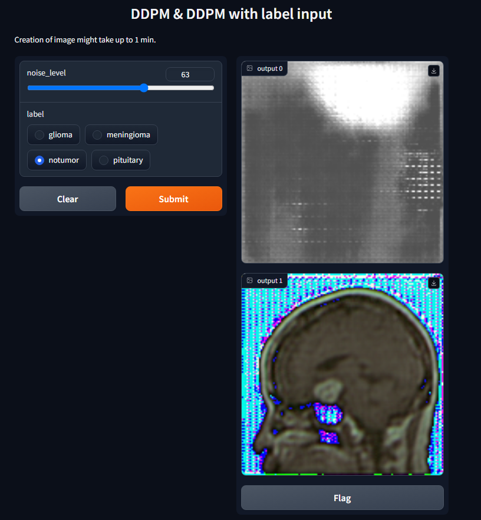

# MEDI-SYN: Medical Image Synthesis
This project presents a study of the application of Generative Adversarial Networks (GANs) and Denoising Diffusion Probabilistic Models (DDPMs) in medical imaging, comparing the generating performance of models. 

## Important Links

| [Timesheet](https://1sfu-my.sharepoint.com/:x:/g/personal/kabhishe_sfu_ca/EUfW7Bq7M2ZNiWasPSkAi8QBwBfu-U5BSOfiO9znWyNtYQ?e=ryKNNX) | [Slack channel](https://sfucmpt340fall2023.slack.com/archives/C05SZPSJC5V) | [Project report](https://drive.google.com/file/d/1MOb_nNaPBgQsmuYrBPUcsizPXZIFY_0G/view?usp=sharing) |
|-----------|---------------|-------------------------|

- Timesheet: [Link](https://1sfu-my.sharepoint.com/:x:/g/personal/kabhishe_sfu_ca/EUfW7Bq7M2ZNiWasPSkAi8QBwBfu-U5BSOfiO9znWyNtYQ?e=ryKNNX)
- Slack channel: [Link](https://sfucmpt340fall2023.slack.com/archives/C05SZPSJC5V)
- Project report: [Link](https://drive.google.com/file/d/1MOb_nNaPBgQsmuYrBPUcsizPXZIFY_0G/view?usp=sharing)


## Video/demo/GIF
- Demo Video: [Link](https://www.youtube.com/watch?v=T6O6fFIYxko)

## Table of Contents
1. [Demo](#demo)

2. [Installation](#installation)

3. [Reproducing this project](#repro)

4. [Guidance](#guide)


<a name="demo"></a>
## 1. Example demo


*Figure 1: Demo image*

```
python src/main.py
```
Click the generated localhost server link.

Adjust the noise level and the input label to re-produce the result.

### What to find where

Explain briefly what files are found where

```bash
repository
├──.github/workflow             ## Evaluation codes
├── src                         ## source codes
├────── main.py                 ## integrated code
├────── Alzheimer_Detector      ## GAN code 
├────── Diffusion               ## DDPM code
├────── chest_data              ## Chest classification code
├────── label                   ## DDPM with label
├── README.md                   ## You are here
```

<a name="installation"></a>

## 2. Installation

```bash
git clone $THISREPO
cd $THISREPO
pip install torch torchvision numpy PIL graphviz optuna imageio
```

<a name="repro"></a>
## 3. Reproduction
```bash

To reproduce ...

>>> Demo (image generation)
python src/main.py

>>> Evaluation Results
python ./.github/workflows/local_test.py
* Edit ./.github/workflows/generated_img ./.github/workflows/real_img with your own data to test different images. 
Output will be saved in src in the form of .txt file

>>> DDPM Model
To reproduce the model
python src/Diffusion/train.py
get data from https://huggingface.co/datasets/alkzar90/NIH-Chest-X-ray-dataset/tree/main/data/images
and extract it in src/data/train/

To get the result from saved model
python src/Diffusion/create_testing_images.py
* No data extract needed

Image outputs will be located in .github/workflows/generated_img

>>> DDMP Model with labels
To reproduce the model and results
python src/label/label_ddpm.py
* No data extract needed.
* Directory will be created

Image outputs will be located in .github/workflows/generated_img

>>> GAN model
To reproduce this model:
Open /src/Alzheimer_Detector/
Download the Alzheimers data with any data label(I used coco) (https://universe.roboflow.com/milestone-wucnp/alzheimer-detector) in this folder
In the downloaded folder there should be 3 files train, test and valid.
Copy those files into a new folder named data. (it should have a train, test, and valid folder that contains images)
Then on the command line, run this command
python -m GAN.py

>>> CNN model
To reproduce this model
Open /src/chest_data/
Download the CoronaHack-ChestXray data (https://www.kaggle.com/datasets/praveengovi/coronahack-chest-xraydataset) in this folder
Now create a new folder chest_data and its subfolders normal, virus, and bacteria in it.
Then go back to the previous chest_data folder where CNN.py is present and on the command line, run this command
python -m CNN.py
```

<a name="guide"></a>
## 4. Guidance

- Use [git](https://git-scm.com/book/en/v2)
    - Do NOT use history re-editing (rebase)
    - Commit messages should be informative:
        - No: 'this should fix it', 'bump' commit messages
        - Yes: 'Resolve invalid API call in updating X'
    - Do NOT include IDE folders (.idea), or hidden files. Update your .gitignore where needed.
    - Do NOT use the repository to upload data
- Use [VSCode](https://code.visualstudio.com/) or a similarly powerful IDE
- Use [Copilot for free](https://dev.to/twizelissa/how-to-enable-github-copilot-for-free-as-student-4kal)
- Sign up for [GitHub Education](https://education.github.com/) 
